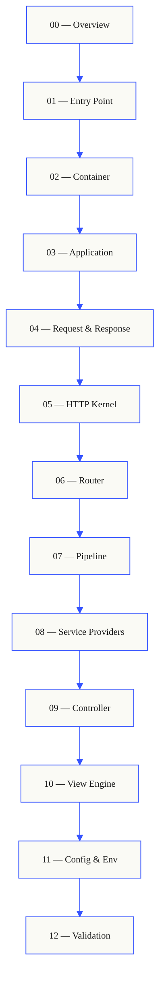

# Laravel From Scratch 🚀

A minimal Laravel-inspired PHP framework designed for learning the core architecture behind modern web applications.

This repository is a small, readable framework built from first principles. It demonstrates the request lifecycle, routing, controllers, views, configuration, validation, and a tiny service container — all with plain PHP and PSR-4 autoloading.

## Features ✨

- Single entry point through `public/index.php`
- PSR-4 autoloading via Composer
- HTTP request and response abstractions
- Simple routing system with controller support
- Basic view rendering engine
- Configuration and environment support
- Validation helper with error handling
- Minimal sample pages: welcome and profile

## Learning Flow

This project is organized as a step-by-step guide in `_docs/`. Each document builds on the previous one, from entry point to validation.



## Project Structure 📁

```text
├── app/                    # application code
│   ├── Controllers/        # request handlers
│   └── Providers/          # service registration
├── bootstrap/              # framework bootstrap
│   └── app.php
├── config/                 # application config
│   └── app.php
├── public/                 # public web root
│   ├── index.php           # front controller
│   └── css/                # static styles
├── resources/              # view templates
│   └── views/
├── routes/                 # route definitions
│   └── web.php
├── src/                    # framework core
│   ├── Config/
│   ├── Container/
│   ├── Foundation/
│   ├── Http/
│   ├── Pipeline/
│   ├── Routing/
│   ├── Support/
│   ├── Validation/
│   ├── View/
│   └── helpers.php
├── composer.json           # PHP dependency config
└── README.md               # this file
```

## Requirements ✅

- PHP 8.2 or higher
- Composer

## Installation 🚀

1. Clone the repository:

```bash
git clone https://github.com/your-username/laravel-from-scratch.git
cd laravel-from-scratch
cp .env.example .env
```

2. Install dependencies:

```bash
composer install
```

3. Start the development server:

```bash
php -S 127.0.0.1:8000 -t public
```

4. Open your browser:

```text
http://127.0.0.1:8000
```

## Development

The framework is intentionally small and readable. The main application flow is:

1. `public/index.php` loads Composer and bootstraps the app
2. `bootstrap/app.php` creates the container and registers services
3. `routes/web.php` defines application routes
4. The router dispatches requests to controllers
5. Controllers return views rendered from `resources/views`

### Key directories 📂

- `app/Controllers` — Controller classes
- `app/Providers` — Service providers for registering framework services
- `config/` — Application configuration values
- `public/` — Web document root
- `resources/views/` — PHP view templates
- `routes/web.php` — Route definitions
- `src/` — Framework implementation files

## Customization 🔧

- Add routes in `routes/web.php`
- Add controller actions in `app/Controllers`
- Add views in `resources/views`
- Use `config('app.key')` to read application settings
- Use `env('APP_ENV')` to detect the running environment

## Notes 📝

This project is intended as an educational demonstration and is not a production-ready framework. It focuses on clarity and the essential building blocks behind a Laravel-like architecture.

## License 📄

MIT
